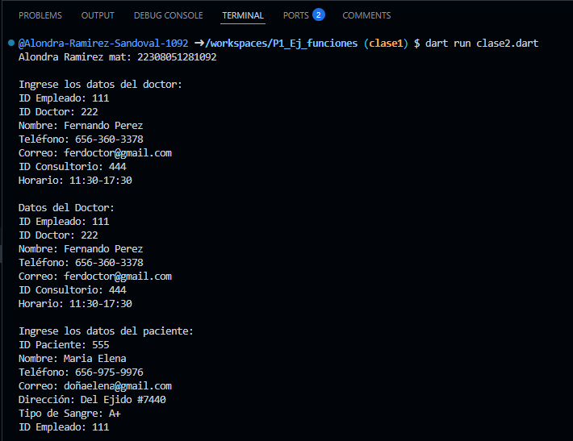
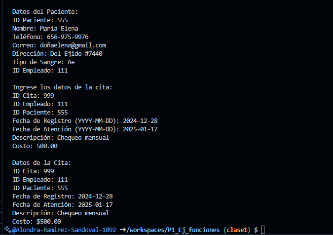

salida de clase2 
crear una clase doctor con 2 atributos(id_empleado, id_doctor,  nombre, telefono, correo, id_consultorio, horario), una funcion captura() y otra mostrar datos(), crear  la instancia y utilizar los atributos y llamadas a funciones. 

otra clase paciente con atributos(id_paciente, nombre, telefono, correo, direccion, tipo_sangre, id_empleado), una funcion captura() y otra mostrar datos(), crear  la instancia y utilizar los atributos y llamadas a funciones. 

otra clase citas con atributos(id_cita, id_empleado,  id_paciente, fecha_registro, fecha_atencion, descripcion, costo), una funcion captura() (donde se puedan ingresar los datos) y otra mostrar datos(), crear  la instancia y utilizar los atributos y llamadas a funciones. lenguaje dart

