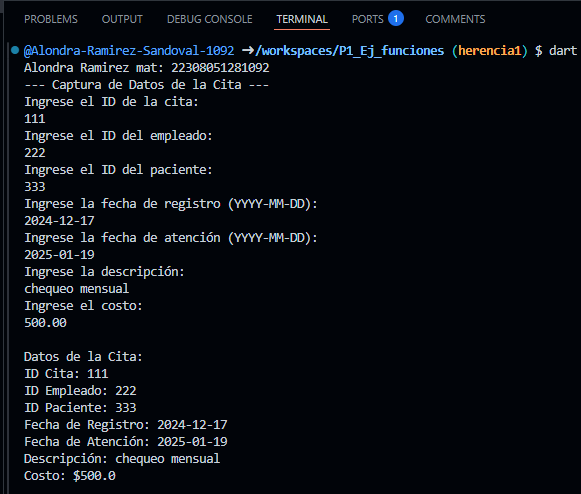
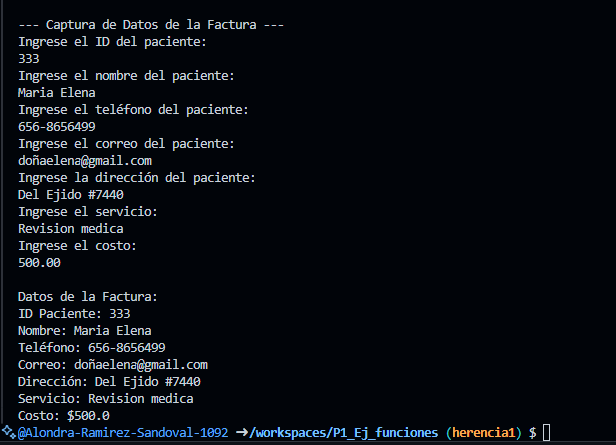

crear la clase citas con los atributos (id_cita, id_empleado, id_paciente, fecha_registro, fecha_atencion, descripcion, costo) con una función capturadatos( ), con interacción de interfaz de usuario, crear la clase DatosCita con herencia citas y una función mostrarDatos.

 otra clase factura con los atributos (id_paciente, nombre, telefono, correo, direccion, servicio, costo) con una funcion capturaFactura( ), con interacción de interfaz de usuario, crear la clase DAtosFactura con herencia factura y una funcion mostrarFactura. lenguaje dart

salida de datos:

