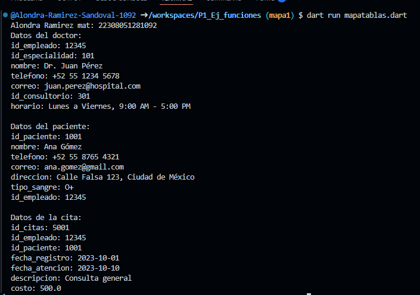

crear map <string, dynamic> doctor con los siguientes key: id_empleado, id_especialidad, nombre, telefono, correo, id_consultorio, horario y mostrar los datos con un forEach. 

otro map <string, dynamic> paciente con los siguientes key: id_paciente, nombre, telefono, correo, direccion, tipo_sangre, id_empleado. 

otro map <string, dynamic> citas con los siguientes key: id_citas, id_empleado, id_paciente, fecha_registro, fecha_atencion, descripcion, costo. en lenguaje dart

salida de datos:

